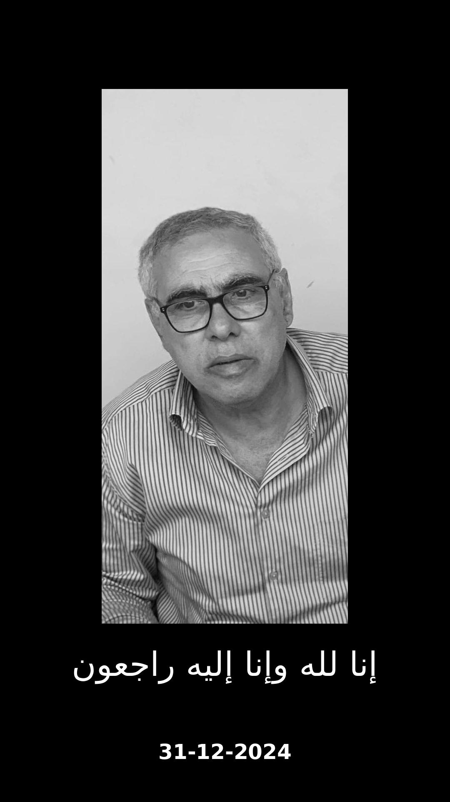

<!DOCTYPE html>
<html lang="ar">
<head>
    <meta charset="UTF-8">
    <meta name="viewport" content="width=device-width, initial-scale=1.0">
    <title>صدقة جارية لروح الحاج رفعت الطنجير</title>
    
    <link href="https://fonts.googleapis.com/css2?family=Amiri&display=swap" rel="stylesheet">
</head>
<body>

    <h1>صدقة جارية لروح الحاج رفعت الطنجير</h1>

    

        
    

    

        <h2>إنا لله وإنا إليه راجعون</h2>
        
اللهم اغفر له وارحمه، واجعل هذه الصدقة في ميزان حسناته.

        

            
قال الله تعالى: "وَمَا تُقَدِّمُوا لِأَنفُسِكُم مِّنْ خَيْرٍ تَجِدُوهُ عِندَ اللَّهِ" (البقرة: 110).

        

        

            <h3>مشاريع الصدقة الجارية:</h3>
            <a href="#">📿 بناء مسجد</a>
            <a href="#">💧 حفر بئر</a>
            <a href="#">👨‍👩‍👧‍👦 كفالة أيتام</a>
        

    

    
تم إنشاء الموقع بواسطة المهندس أحمد محمد عادل الطنجير | في ذكرى وفاته: 31-12-2024

</body>
</html>
